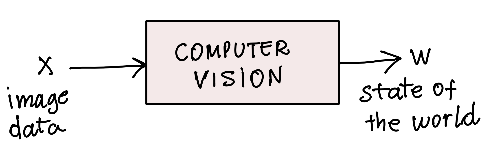
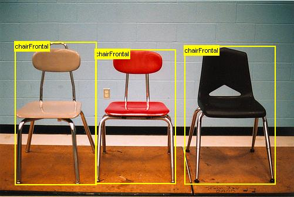
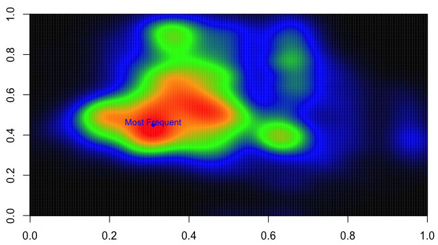
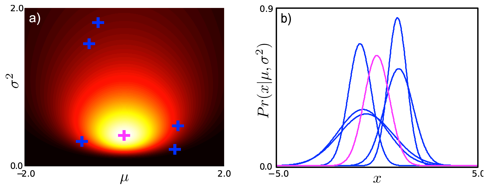
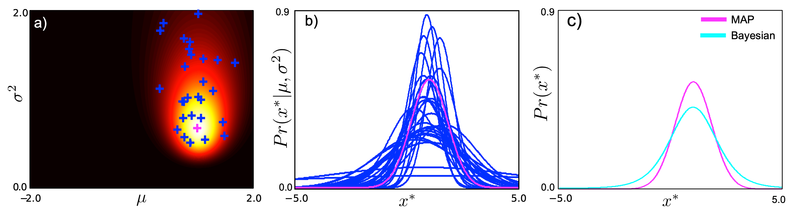

# Model fitting in computer vision

#### Computer vision problems

**Input**: visual data ${\bf x}$

**Output**: state of the world ${\bf w}$  

The diagram in Figure 1 summarizes a computer vision algorithm. 

**Figure 1**: Computer vision algorithms. Algorithm takes image data ${\bf x}$ as input and outputs the state of the world ${\bf w}$.

#### Types of computer vision problems

Most computer-vision problems can be of two types: regression and classification.  

- **Regression**: State of the world is continuous  (e.g., distance from the camera to an object, location of a target). Figure 1 shows two examples of regression problems in computer vision. 

  |  |  |
  | :----------------------------------------------------------- | ------------------------------------------------------------ |

  **Figure 2**: Examples of regression problems in computer vision. **Left**: Human pose estimation. **Right**: Predicting house prices from images. 

  

- **Classification**: State of the world is discrete (e.g., class of an object, detecting an anomaly). Figure 3 shows two examples of classification problems. The furniture-detection task shown in the figure can be considered a bit of a mixed problem as the algorithm needs to classify the different furniture objects and also locate them. Locating objects is a detection tasks which is a regression of the object’s location  (and often of its bounding box). 

  |  |      |
  | ------------------------------------------------------------ | ---- |

**Figure 3**: Examples of classification problems in computer vision. **Left**: Furniture classification and detection. **Right**: Bird classification. 

Often, we solve these problems using a modeling approach. 

#### Model-fitting solution  

Solutions to vision problems usually comprise the following components: 

- **A (mathematical) model** that describes the relationship between the visual data ${\bf x}$ and the state of the world ${\bf w}$. Models can be *parametric* or *non-parametric*. Parametric models are parametric equations (i.e., have adjustable model parameters). Non-parametric models are usually built directly from the measurement data and do not have adjustable parameters (e.g., histograms, heat maps, tree data structures).   

  |  |  |
  | ------------------------------------------------------------ | ------------------------------------------------------------ |
  | Image from: https://en.wikipedia.org/wiki/Polynomial_regression | Image from: https://www.datacamp.com/tutorial/bivariate-heatmaps |

  **Figure 4**: **Left**: Regression using a parametric cubic polynomial model $y = a_0 + a_1 x + a_2 x^2 + a_3 x^3$. **Right**: Non-parametric model representing the probability of demand for bike ride shares. 

  

- **Measured data or measurements**. The measured data consist of a set of paired training examples $\{{\bf x}_i, {\bf w}_i\}$ which represent known measurements and their corresponding states of the world.
- **A model-fitting algorithm (or learning algorithm)**. We will use this algorithm to fit the model to the measured data. When using parametric models, the model-fitting algorithm estimates the values of the parameters that result in the best agreement between the model predictions and the measured data. When using non-parametric models, the model-fitting algorithm is simply the method that creates the model (e.g., counting, binning in histograms, accumulating values in a heat map, creating a tree data structure). 
- **An inference algorithm**. This algorithm takes new measured data (e.g., images or image measurements) as input to the model to make predictions about the state of the world ${\bf w}$. 

#### Dealing with uncertainty

Modeling real-life problems usually involve dealing with *noisy measurements*. In addition to calculating with noisy measurements, the model itself is often an approximation of the actual problem we want to solve or the process that we want to represent. As a result, we need a mathematical framework to account for the uncertainty of the measurements and imprecision of the model. Figure 5 shows samples of distributions of the locations of a robot turning at corners of a square path. 

|  |  |
| ------------------------------------------------------------ | ------------------------------------------------------------ |

**Figure 5**: Incremental accumulation of errors of a moving robot. **Left**: Gradual motion drift due to errors such as misalignment, wheel slip. **Right**: Calibrated robot return most of the times to the correct location. Figure from Andrew Davison’s lecture slides on robotics (https://www.doc.ic.ac.uk/~ajd/Robotics/RoboticsResources/lecture4.pdf).

Probability theory gives us the tools to model uncertainty. Here, the approach is to define or choose suitable probability distributions to represent the uncertainty in our data and model. The basic framework for probabilistic modeling is the Bayes equation. 

#### The Bayes equation or posterior probability

$$
P(y|x) = \frac{P(x|y)\,P(y)}{P(x)}
$$

When modeling problems using probabilities, our main tool is the *Bayes' rule*. It represents the *posterior distribution* of the world state given the measurements (Prince, Equation 2.9). The Bayes rule can be written as: 

$$
\begin{align}
\overbrace{P\left(\text{world state} \,| \text{measurements}\right)}^{\text{posterior}} = \frac{\overbrace{P\left( \text{measurements}\,| \text{world state}\right)}^{\text{likelihood}}\times\overbrace{P\left(\text{world state}\right)}^{\text{prior}}  }{\underbrace{P\left( \text{measurements}\right)}_{\text{normalization term}} }.
\end{align}
$$
The Bayes' equation has two main factors. One factor is the *likelihood*, which describes the relationship between the measurements and the sensor model. Assuming that we have multiple choices of world states, the likelihood is a function that tells us how well our measurements fit (i.e., are *explained* by) our current choice of world state. The likelihood function can also be seen as a *data-closeness* measure under a selected world state or model. 

The other factor is the *prior* or *prior belief*, which describes the uncertainty of the world states. Assuming that some world states are more probable than others, the prior gives us a description of how probable each world state is.  

In modeling problems, the likelihood and prior are often represented by parameterized functions. Usually, we model the *data* (i.e., noisy measurements) or we model the *state-of-the-world* (e.g., classification label, location of an object, ID of a face). 

When designing the model, we choose the form of the likelihood function that best represents the domain of the quantity that describes the relationship between the world state and the measurements. Then, we choose the prior that best represents the domain of the parameters of the likelihood function. Ideally, we want to choose a prior that is *the conjugate* of the likelihood function (Prince, Chapter 3). For example, if we chose a *Bernoulli* distribution as the likelihood, then we would choose the *Beta* distribution as the prior. If we chose a *multivariate Gaussian* as the likelihood, we would choose the *normal inverse Wishart* as the prior. By choosing a conjugate prior, calculations yield a closed-form equation of the posterior, with the nice property that the final posterior retains the same *form* of the prior, i.e.:  

$$
\begin{align}
\text{Posterior} &= \overbrace{\text{Bernoulli}}^{\text{likelihood}} \times \overbrace{\text{Beta}}^{\text{prior}} = \text{Beta}.\notag\\ 
\text{Posterior} &=  \overbrace{\text{multivariate\_Gaussian}}^{\text{likelihood}} \times  \overbrace{\text{inverseWishart}}^{\text{prior}} = \text{inverseWishart}. 
\end{align}
$$
This preservation of the form of the initial prior by the posterior conveys the notion that the *posterior belief* is the *updated prior belief* after we accounted for the measurement (i.e., our prior belief changed once we learned more information).

Using a conjugate prior yields a posterior distribution from which we can sample plausible realizations of the model (Prince, Chapter 4). Figure 6(right) shows six plausible models sampled from a prior distribution that is conjugate of the univariate Gaussian Figure 6(left). 

**Figure 6**: Sampling from the prior distribution (Figure 4.4, Prince). **Left**: The prior distribution. **Right**: Six plausible models sampled from the prior. See Prince's book for details.

The samples shown in Figure 6 (right) come from the prior distribution in Figure 6 (left). While samples from the prior are plausible models, they do not take into account the measurements. To take into account the measurements, we ultimately want to sample from the posterior distribution since the posterior combines information from both the prior and the likelihood.  

The ability to sample from the posterior distribution is key to making Bayesian predictions. The Bayesian prediction is found by averaging over many samples generated from the posterior. A nice example of this sampling (and averaging/prediction) procedure is shown in Figure 7 (Figure 4.7, Prince). 

**Figure 7**: Sampling from the posterior (Figure 4.7, Prince). (a) Posterior. (b) Samples. (c) Averaged plausible models. See Prince's book for details.

Figure 8 shows an example of using the posterior distribution for detecting human pose in computer vision (Andriluka et al., 2009: Pictorial Structures Revisited, CVPR 2009).

**Figure 8**: **Top**: Detected poses. **Bottom**: Samples from posterior distribution. See (Andriluka et al., 2009: Pictorial Structures Revisited, CVPR 2009) for details.

In Chapter 4 (Prince), we see the advantages of using the predictive densities for the Bayesian approach in comparison to using the predictive densities for the MAP and ML approaches. However, the Bayesian predictive approach can be computationally intractable. Regardless the approach we use to fit the model and calculate the predictive densities (i.e., ML, MAP, Bayesian), our modeling problem will revolve around obtaining the posterior distribution over the model parameters, i.e., $P\left(\theta\,|\,{\bf x}_{1 \dots I}\right)$ (Chapter 4, Prince).

In Chapter 4, you will learn how to estimate the parameters of the model given the data. This is the ``learning'' step of the modeling approach. You will see that there are three main ways in which we can learn the model parameters: 

1. **Maximum likelihood (ML)**. When using ML, we ignore the prior and maximize the likelihood function.
2. **Maximum a Posteriori (MAP)**. Here, we maximize the product between the likelihood and prior. 
3. **Bayesian estimation**. We estimate the posterior distribution and then average over all samples from the posterior distribution.  

Still in Chapter 4, you will see that all these procedures end up estimating the predictive density (Eq. 4.5, Prince), and that the predictive density of the ML and MAP approaches can be seen as a special case of the Bayesian predictive density (Eq. 4.6, Prince). By seeing ML and MAP as special cases of Bayesian, we can simply think that we always aim at solving Bayesian by using Eq. 4.5 (Prince) but sometimes we end up *settling* for solving Eq. 4.6 (Prince) either with ML or MAP. The reason we settle for ML or MAP is because they might be more convenient for some reason (e.g., we do not have a prior, problem has too many parameters, MAP or ML solution might be good enough). 

In Chapter 6 (Prince), you will learn about the two models that relate data to the state-of-the-world, i.e., *discriminative* and *generative* models. This chapter also gives an example of a regression problem and and classification problem. 

#### Bayesian estimation 

- There may be many different parameter values that can explain the data. As a result, we should calculate the entire posterior distribution instead of trying to determine a single set of parameter values, i.e.:   

$$
P\left( \boldsymbol\theta | {\bf x}_{1,\dots,I}\right) = \frac{\prod_{i=1}^I P\left({\bf x}_{i}|\boldsymbol\theta\right)P\left(\boldsymbol\theta\right)}{P\left({\bf x}_{1,\dots,I}\right)}
$$

#### Maximum a posteriori 

Estimate the model parameters by maximizing the posterior probability, i.e.: 
$$
\hat{\boldsymbol\theta} = \underset{\boldsymbol\theta}{\arg\max}[P\left( \boldsymbol\theta | {\bf x}_{1,\dots,I}\right)]
$$

$$
\hat{\boldsymbol\theta} = \underset{\boldsymbol\theta}{\arg\max}[P\left({\bf x}_{1,\dots,I} | \boldsymbol\theta\right)]
$$
